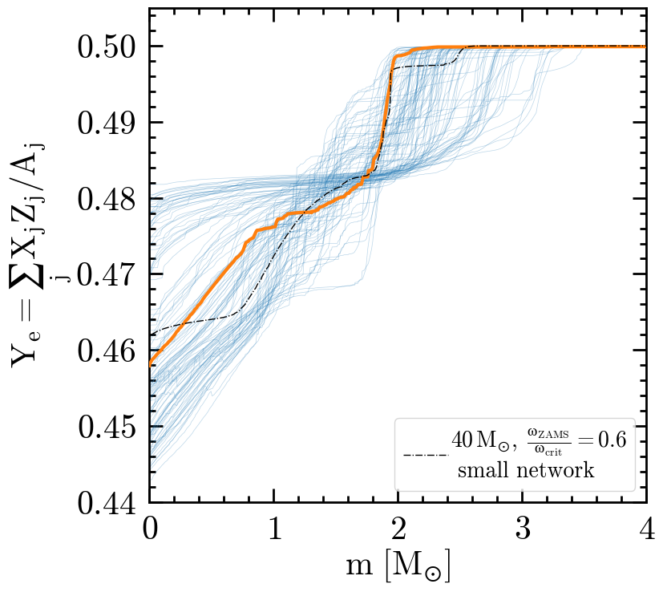

#+title: A grid of fast-rotating, chemically-homogeneous, supernova and/or long-GRB progenitors
#+author: [[mrenzo@arizona.edu][Mathieu Renzo]] et al.

#+BEGIN_html

#+END_html

** How to build the paper

*TL;DR*: run =build.sh=, it will interactively ask whether to download the
data from zenodo, re-make the figures, and compile the pdf.

This package is structured as follows:
#+BEGIN_SRC bash
❯ tree -d
.
├── data
├── manuscript
│   ├── auto
│   └── figures
├── MESA_setup
│   ├── make
│   └── src
└── scripts

9 directories
#+END_SRC

The python scripts in [[./scripts]] to build the figures assume the data
exist and are unpacked in [[./data]]. You can download them manually from
the [[https://doi.org/10.5281/zenodo.14286306][zenodo repository]] the =grid.tar= and unpack in =./data=.

To plot the model from [[https://ui.adsabs.harvard.edu/abs/2024RNAAS...8..152R/abstract][Renzo et al. 2024]], one stellar model is fetched
from [[https://doi.org/10.5281/zenodo.11375523][this other zenodo repository]]. The python scripts will =pass= if
this is missing.

*WARNING*: the compressed dataset is ~ 8GB, and becomes ~15GB once
unpacked.

The =build.sh= script can call [[./script/data_prep.sh]] and download and
unpack for you.

** How to reproduce the simulations

These where done with [[./mesastar.org][MESA]], version =r24.03.1=, with the MESA SDK
=x86_64-linux-23.7.3= on =Rocky OS 7=.

*WARNING*: the exact code used is available on zenodo in
=template.tar.xz=, the code in the repository may not correspond exactly
due to further small experiments run after the grid.

** Figure-by-figure

Create the python environment first with

#+BEGIN_SRC
  cd scripts/
  mamba create -f environment.yml
  mamba activate CHE_jet
#+END_SRC

*** Figure 1 - Grid overview

Run =./scripts/grid_success.py= manually to create:

[[./manuscript/figures/overview_grid.png]]

*** Figure 2 - Multipanel

Individual panels can be generated from the notebook
=scritps/grid_plots.ipynb=. Run =scripts/multi_panel.py= to generate the
multipanel figure.

**** Herzsprung-Russel diagram

[[./manuscript/figures/HRD_grid.png]]

**** Electron fraction Y_{e}

[[./manuscript/figures/Ye_grid.png]]

**** Density profiles

[[./manuscript/figures/rho_grid.png]]

**** Specific angular momentum profiles

[[./manuscript/figures/j_grid.png]]

*** Figure 3 - Entropy profile

Run =scripts/entropy.py= to generate

*** Figure 4 - Tayler-Spruit generated magnetic fields

Run =scripts/B-fields.py= to generate
[[./manuscript/figures/B-grid.png]]

*** Figure 5 - Compactness

Run =scripts/xi_M.py= to generate
[[./manuscript/figures/xi_M.png]]

*** Table 1
The table header and caption are prepared in =./manuscript/table.tex=,
the content can be generated with [[./scripts/make_table_content.py]] and
manually copied in that file.

The =build.sh= script assumes =./manuscript/table.tex= is ready to be
compiled.

** Dependencies
*** Python
Environment managed with =mamba 2.1.1=, see [[./scripts/environment.yml]].
*** Latex
#+begin_src bash
  ❯ pdflatex --version
  pdfTeX 3.141592653-2.6-1.40.26 (TeX Live 2025/dev/Debian)
  kpathsea version 6.4.0/dev
  ❯ bibtex --version
  BibTeX 0.99d (TeX Live 2025/dev/Debian)
#+end_src
*** System dependencies
#+BEGIN_SRC bash
  ❯ wget --version
  GNU Wget 1.25.0 built on linux-gnu.
  ❯ tar --version
  tar (GNU tar) 1.35
#+END_SRC

** TODO
- [ ] make [[./scripts/data_prep.sh]] download only =grid.tar=
- [ ] make download and unpack ask for confirmation
