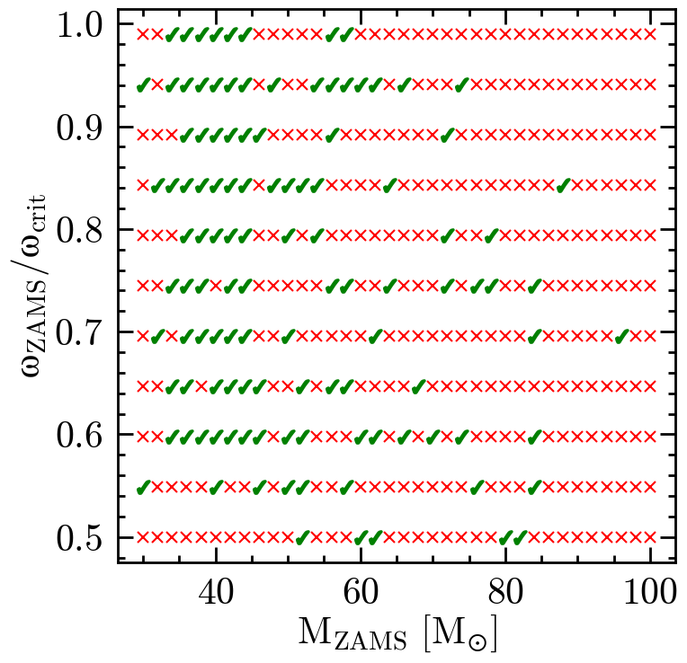
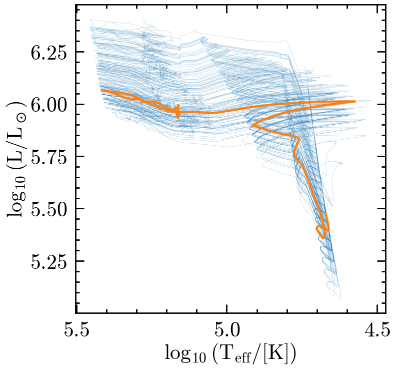
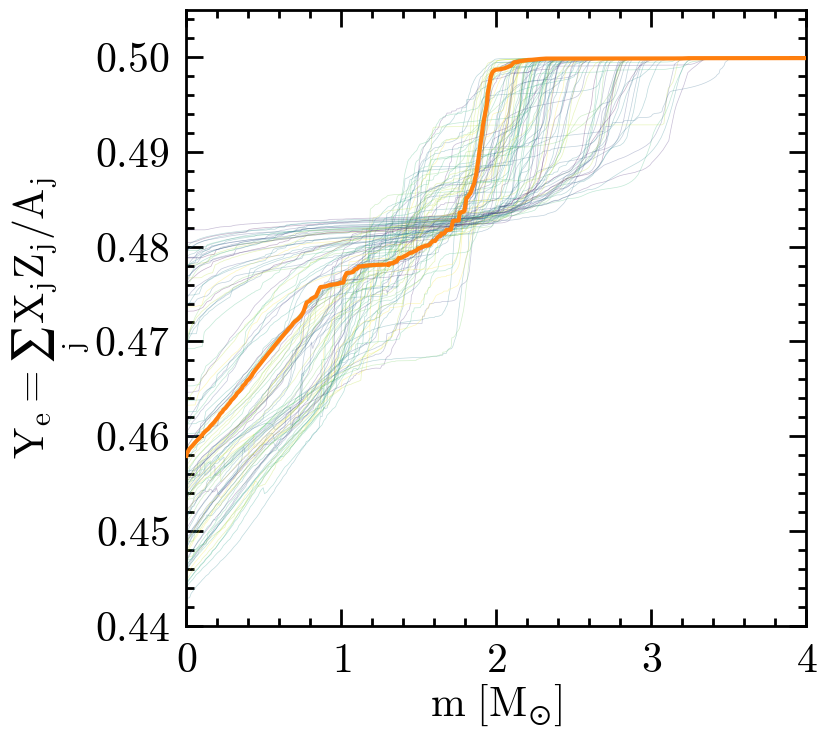
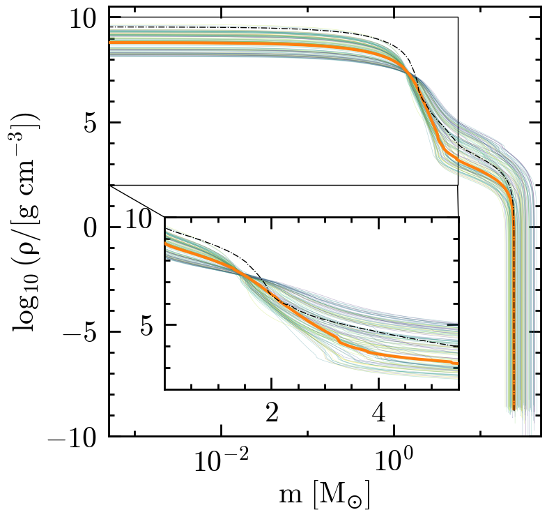
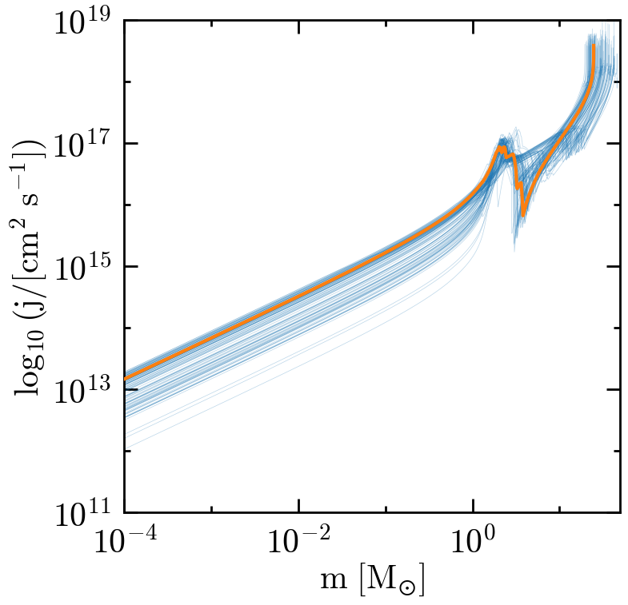
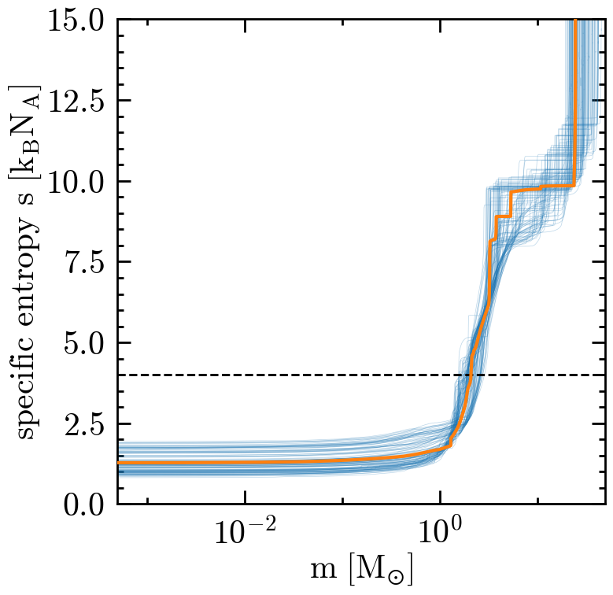
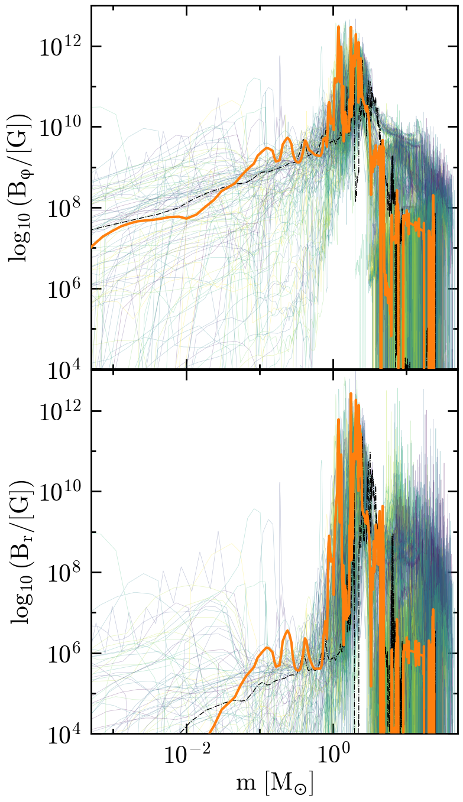
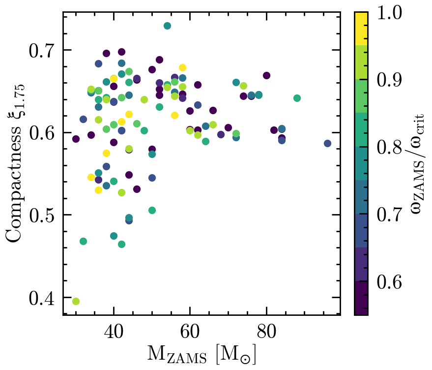

#+title: A grid of fast-rotating, chemically-homogeneous, supernova and/or long-GRB progenitors
#+author: [[mrenzo@arizona.edu][Mathieu Renzo]] et al.

#+BEGIN_html

#+END_html

** How to build the paper

*TL;DR*: run =build.sh=, it will interactively ask whether to download
the data from zenodo, create a python environment, re-make the
figures, and compile the pdf.

If =build.sh= is not executable, make it so with =chmod +x build.sh=
and then run the script.

If you have enough disk space (>15Gb), have =mamba= installed, and
don't want to stare at the build prompts, run =build.sh --yes=.  If
you want to run the full build except one of the steps you can pass
arguments to skip one step, see =build.sh --help=.

This package is structured as follows:
#+BEGIN_SRC bash
❯ tree -d
.
├── data
├── manuscript
│   ├── auto
│   └── figures
├── MESA_setup
│   ├── make
│   └── src
└── scripts

9 directories
#+END_SRC

You can locally work on the =*.tex= files inside =manuscript=, or work on
the scripts and/or MESA setup as you would normally, without worrying
about reproducibility until the article is almost ready, and adapt the
top level [[./build.sh]] to call the scripts to re-make all the figures
and compile the pdf of the article at the end.

The python scripts in [[./scripts]] to build the figures assume the data
exist and are unpacked in [[./data]]. You can download them manually from
the [[https://doi.org/10.5281/zenodo.14286306][zenodo repository]] the =grid.tar= and unpack in =./data=.

To plot the model from [[https://ui.adsabs.harvard.edu/abs/2024RNAAS...8..152R/abstract][Renzo et al. 2024]], one stellar model is fetched
from [[https://doi.org/10.5281/zenodo.11375523][this other zenodo repository]]. The python scripts will =pass= if
this is missing. The =build.sh= script can call [[./script/data_prep.sh]]
and download and unpack for you.

**** ⚠️ Warning ⚠️
The compressed dataset is ~ 8GB, and becomes ~15GB once
unpacked. If uncompressing manually, make sure to create a folder per
each tarball in =grid.tar=, otherwise data from each model will be
overwritten by the next.

Zenodo has been experiencing performance issues.

**** ⚠️ Warning ⚠️
The zenodo repository is not publicly accessible /yet/. As of
now, before running the =build.sh= script (or, specifically, the
=data_prep.sh= script) you need to:

1. make sure you have access by contacting me
2. run =export ZENODO_TOKEN=<your token>=

=data_prep.sh= is designed to use a customized header passing the token
at this stage with this hack:

#+begin_src bash
wget -U firefox -c -O grid.tar --header="Authorization: Bearer $ZENODO_TOKEN" \
  "https://zenodo.org/api/records/14286306/draft/files/grid.tar/content" || \
    echo "The repo may still be private. Remember to export ZENODO_TOKEN=<your token> and verify you have access."
#+end_src

which will reduce to
#+begin_src bash
wget -U firefox -c -O grid.tar  "https://zenodo.org/api/records/14286306/files/grid.tar"
#+end_src
when the zenodo repo becomes public.

** How to reproduce the simulations

These where done with [[./mesastar.org][MESA]], version =r24.03.1=, with the MESA SDK
=x86_64-linux-23.7.3= on =Rocky OS 7=.

**** ⚠️ Warning ⚠️
The exact code used is available on zenodo in =template.tar.xz=, the
code in the repository may not correspond exactly due to further small
experiments run after the grid.

** Figure-by-figure
Create the python environment first with

#+BEGIN_SRC
  cd scripts/
  mamba create -f environment.yml
  mamba activate CHE_jet
#+END_SRC

*** Figure 1 - Grid overview

Run [[./scripts/grid_success.py]] manually to create:

*** Figure 2 - Multipanel

Individual panels can be generated from the notebook
[[scritps/grid_plots.ipynb]]. Run [[scripts/multi_panel.py]] to generate the
multipanel figure.

**** Herzsprung-Russel diagram

**** Electron fraction Y_{e}

**** Density profiles

**** Specific angular momentum profiles

*** Figure 3 - Entropy profile

Run [[scripts/entropy.py]] to generate

*** Figure 4 - Tayler-Spruit generated magnetic fields

Run [[scripts/B-fields.py]] to generate

*** Figure 5 - Compactness

Run [[scripts/xi_M.py]] to generate

*** Table 1
The table header and caption are prepared in =./manuscript/table.tex=,
the content can be generated with [[./scripts/make_table_content.py]] and
manually copied in that file.

The =build.sh= script assumes =./manuscript/table.tex= is ready to be
compiled.

** Dependencies
*** Python
Environment managed with =mamba 2.1.1=, see [[./scripts/environment.yml]].
*** Latex
#+begin_src bash
  ❯ pdflatex --version
  pdfTeX 3.141592653-2.6-1.40.26 (TeX Live 2025/dev/Debian)
  kpathsea version 6.4.0/dev
  ❯ bibtex --version
  BibTeX 0.99d (TeX Live 2025/dev/Debian)
#+end_src
*** System dependencies
#+BEGIN_SRC bash
  ❯ wget --version
  GNU Wget 1.25.0 built on linux-gnu.
  ❯ tar --version
  tar (GNU tar) 1.35
#+END_SRC

** TODO lGRB progenitors
- [X] make [[./scripts/data_prep.sh]] download only =grid.tar=
- [ ] Confirm OS on =rusty= (@matteocantiello)
- [ ] Compare to KEPLER's 35M_{\odot} models from Wooley & Heger 2006
- [ ] fix download script for when repo is public
